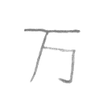

# han-character-ml
Repository to create han character ML

# Content
- Instalation
- Utilization


# Instalation
## Download Kanji image dataset (non-commercial propose):
Link: http://etlcdb.db.aist.go.jp/
- Register on the ETL page to gain access to the dataset
- Clone etl extractor: https://github.com/choo/etlcdb-image-extractor
- With the extractor, extract ETL8G

## Script execution order:
- Execute read_kanji.py to filter hiragana character and compressed the image dataset to a compressed numpy file (npz)
```
python read_kanji.py
```
- Execute generate_training_data.py to generate npz training/testing data
```
python generate_training_data.py
```

# Utilization
## Entry data
The ML model requires an image wiht a format of 48x48 and color black kanji as an entry parameter
<br/> 

## Return value
The ML model after proccessing the data it's return and array of images with the same format as the entry data
